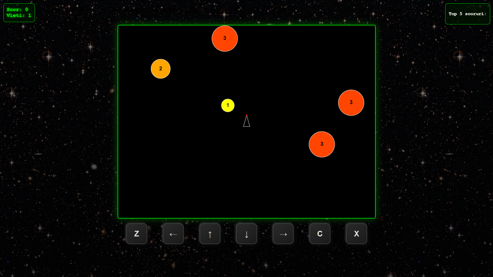

# 🚀 Retro Asteroids Clone

A fully playable, browser-based recreation of the classic arcade shooter "Asteroids". Built entirely from scratch using **Vanilla JavaScript** and the **HTML5 Canvas API**, featuring custom physics, mobile support, and local data persistence.



## 🎮 Play the Game
[**Click here to play the live demo!**](https://stefanmiroiu.github.io/Asteroids-Game/)

## ✨ Key Features

* **🕹️ Classic Arcade Action:** Navigate your ship, dodge incoming asteroids, and destroy them to earn points.
* **💥 Dynamic Physics Engine:**
    * **Custom Collision Detection:** Implements Euclidean distance formulas to detect impacts between the ship, bullets, and asteroids.
    * **Elastic Collisions:** Asteroids bounce off each other realistically when they collide.
    * **Screen Wrapping:** Objects traversing the screen edge reappear on the opposite side.
* **📱 Mobile-First Design:** Fully responsive layout with custom on-screen touch controls for mobile play (D-pad + Action buttons).
* **💾 High Score System:** Uses the browser's `localStorage` API to save and retrieve the top 5 high scores persistently.
* **🔊 Audio Feedback:** Retro sound effects for shooting mechanics.
* **📈 Progressive Difficulty:** Asteroids split into smaller, faster pieces when hit; extra lives awarded every 1000 points.

## 🛠️ Tech Stack

* **Core:** HTML5, CSS3, JavaScript (ES6+)
* **Rendering:** HTML5 Canvas API (2D Context)
* **Styling:** CSS3 Flexbox & CRT monitor effects (Glow/Shadows)
* **No external libraries or frameworks used.**

## 🕹️ Controls

### Desktop (Keyboard)
| Key | Action |
| :--- | :--- |
| **Arrow Keys** | Move Ship (Up, Down, Left, Right) |
| **Z** | Rotate Aim Left |
| **C** | Rotate Aim Right |
| **X** | Fire Laser |

### Mobile (Touch)
* **On-screen D-Pad:** Movement
* **Z / C Buttons:** Rotation
* **X Button:** Fire (Active State Visuals Included)

## 📂 Project Structure

```text
/
├── index.html      # Main game structure and UI overlay
├── style.css       # CRT effects, responsiveness, and UI styling
├── script.js       # Game loop, physics logic, and state management
├── media/          # Assets (Background images, sound effects)
└── README.md       # Project documentation
